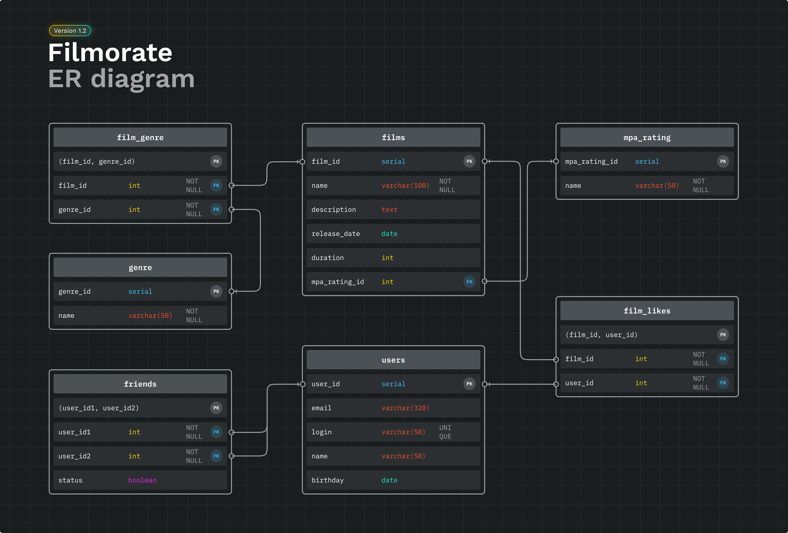

# Filmorate Database
Важные аспекты проектирования:
* Каждый столбец таблицы содержит только одно значение.
* Все неключевые атрибуты однозначно определяются ключом.
* Все неключевые атрибуты зависят только от первичного ключа, а не от других неключевых атрибутов.
* База данных должна поддерживает бизнес-логику, предусмотренную в приложении: получение всех фильмов, пользователей, выборка топ-N наиболее популярных фильмов по лайкам и списка общих друзей с другим пользователем.

### ER-диаграмма


Для сохранения информации о жанрах фильмов, лучше вынести их в отдельную таблицу **(film_genre, genre)** и использовать внешний ключ для связи с таблицей **film**. Такая структура таблиц позволит удобно работать с жанрами фильмов и упростит запросы, связанные с выборкой фильмов по жанру.

Таблица **friends** хранит информацию о дружбе между пользователями. Столбцы *user1_id* и *user2_id* будут содержать ID пользователей, между которыми существует дружба. Столбец status будет хранить информацию о статусе дружбы. При этом в таблице не будет дубликатов, например, если пользователь 1 и пользователь 2 уже имеют отношения "друзья", то запись о дружбе между ними будет только одна.

### Примеры запросов

```sql
--Получение всех пользователей
SELECT *
FROM users;
```

```sql
--Выборка ТОП-5 наиболее популярных фильмов по лайкам
SELECT name,
       COUNT(*) AS likes_count
FROM films
JOIN film_likes ON films.film_id = film_likes.film_id
GROUP BY films.film_id
ORDER BY likes_count DESC
LIMIT 5;
```

```sql
SELECT name
FROM users as u
JOIN friends f ON u.user_id = f.user_id1
WHERE f.user_id2 = 2
  AND f.status = TRUE
  AND EXISTS
    (SELECT 1
     FROM friends as f2
     WHERE f2.user_id1 = 1
       AND f2.user_id2 = f.user_id2
       AND f2.status = TRUE )
ORDER BY name;
```

Последний запрос выберет имена всех друзей, которые есть у пользователя с ID 2 и которые также являются друзьями пользователя с ID 1. Результат будет отсортирован по именам пользователей в алфавитном порядке.
Чтобы оптимизировать производительность, можно использовать оператор EXISTS с фиктивным столбцом 1 **(SELECT 1)** в подзапросе, вместо выборки реальных столбцов. Это позволяет избежать чтения и выборки всех строк из таблицы, которая не нужна для определения наличия строк, удовлетворяющих условию.

